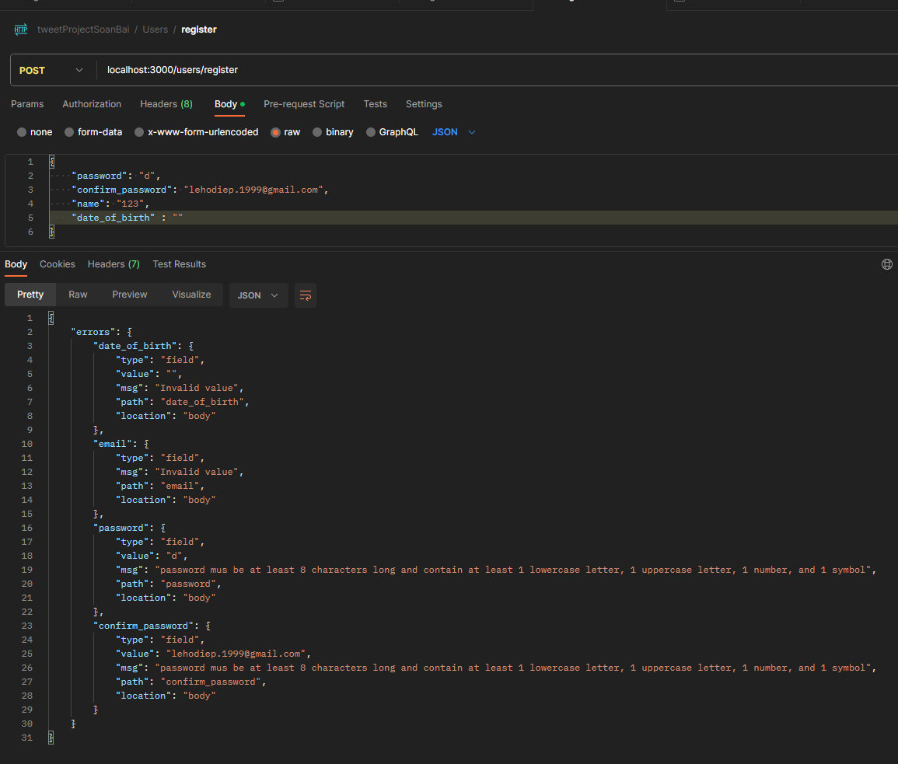

# cài đặt express validator cho dự án Twitter

## cài đặt express validator

```bash
npm i express-validator
```

- trước đây để validator người ta dùng validation chain

```js
query("person")
  .notEmpty()
  .withMessage("Person query không được bỏ trống nha")
  .escape();
```

- nhưng gần đây thì ngta đã thay thế nó bằng checkSchema validation rồi, nhìn nó sẽ trực quan và dể viết hơn

## chỉnh sửa lại route đăng ký (register) hoàn chỉnh

- mô tả route Register

  ```ts
  // Description: Register a new user
  // Path: /register
  // Method: POST
  // Body: {
  //     email: string,
  //     password: string,
  //     confirm_password: string
  //     date_of_birth: ISO8601

  // }

  usersRouter.post("/register", registerValidator, registerController);
  //registerValidator là middleware để validate dữ liệu được dùng checkSchema của express-validator
  ```

- trong `user.middleware.ts` ta tạo middleware cho việc register của user

  - tạo middleware `registerValidator` trong `user.middleware.ts`, nhưng thay vì viết như thế này

  ```ts
    export const registerValidator = (req: Request, res: Response, next: NextFunction) => {....
  ```

  ta sẽ dùng checkShema của thằng express-validator để nó tiện vào trực quan
  checkShema được tạo ra từ [validatorjs](https://github.com/validatorjs/validator.js), nên ta có thể sử dụng các method trong này

  ```ts
    //khai báo
    import { checkSchema } from 'express-validator'

    export const registerValidator = export const registerValidator = checkSchema({
        name: {

        }
    })
  ```

  ta có thể tìm kiếm ở mục tìm kiếm các hàm như islength để valid thuộc tính
  
  trong đó có cả hàm isStrongPassword 

  ta sẽ có registerValidator middleware như sau

  ```ts
  export const registerValidator = checkSchema({
    name: {
      notEmpty: true,
      isString: true,
      trim: true,
      isLength: {
        options: {
          min: 1,
          max: 100,
        },
      },
    },
    email: {
      notEmpty: true,
      isEmail: true,
      trim: true,
    },
    password: {
      notEmpty: true,
      isString: true,
      isLength: {
        options: {
          min: 8,
          max: 50,
        },
      },
      isStrongPassword: {
        options: {
          minLength: 8,
          minLowercase: 1,
          minUppercase: 1,
          minNumbers: 1,
          minSymbols: 1,
          // returnScore: false
          // false : chỉ return true nếu password mạnh, false nếu k
          // true : return về chất lượng password(trên thang điểm 10)
        },
      },
      errorMessage:
        "password mus be at least 8 characters long and contain at least 1 lowercase letter, 1 uppercase letter, 1 number, and 1 symbol",
    },
    confirm_password: {
      notEmpty: true,
      isString: true,
      isLength: {
        options: {
          min: 8,
          max: 50,
        },
      },
      isStrongPassword: {
        options: {
          minLength: 8,
          minLowercase: 1,
          minUppercase: 1,
          minNumbers: 1,
          minSymbols: 1,
        },
      },
      errorMessage:
        "password mus be at least 8 characters long and contain at least 1 lowercase letter, 1 uppercase letter, 1 number, and 1 symbol",
    },
    date_of_birth: {
      isISO8601: {
        options: {
          strict: true,
          strictSeparator: true,
        },
      },
    },
  });
  ```

  - ta vào file `users.routes.ts` thêm middleware cho route `/register`

  ```ts
  //khai báo
  import {
    loginValidator,
    registerValidator,
  } from "~/middlewares/users.middlewares";

  /*
  des: đăng ký tài khoản
  path: /users/register
  method: POST
  body: {name, email, password, confirm_password, date_of_birth}
  */
  //cập nhật route thêm middleware
  usersRouter.post("/register", registerValidator, registerController);
  ```

  - test thử api register bằng postman, ta cố tình truyền sai data
    
  - như hình thì ta đã tạo thành công user mới dù đã truyền sai giá t trị của các `trường dữ liệu`, điều đó đồng nghĩa rằng registerController vẫn chạy bình thường

- ta phải dùng đến `validation runner ` của `express-validator` để nếu có `trường dữ liệu` nào bị lỗi, ta lập tức sẽ báo lỗi ngay

  - ta có thể xem qua document ở đây [doc validator](https://express-validator.github.io/docs/guides/manually-running)
  - trong `utils` tạo file `validation.ts` và copy đoạn code đầu tiên(chuyển sang ts) trên doc bỏ vào
  - vì đoạn code dưới là demo của js nên ta phải chỉnh nó lại ở các kiểu dữ liệu để phù hợp với ts
    
    ta fix đoạn code trong file `validation.ts` thành thế này

    ```ts
    import express from "express";
    import { body, validationResult, ValidationChain } from "express-validator";
    import { RunnableValidationChains } from "express-validator/src/middlewares/schema";

    //export ở ngoài xài đc hàm validate
    //hàm validate có 2 cách xài:
    //  1 - giống như  mẫu xài trực tiếp trên validationChain như này post('/signup', validate([ body('email').isEmail(), ...])
    //      vậy thì khai báo sẽ là const validate = (validations: ValidationChain[]) => {

    //  2 - nhưng ở đây ta xài checkSchema,  checkSchema sẽ return ra RunnableValidationChains<ValidationChain>
    // nên khai báo sẽ như dưới đây
    export const validate = (
      validations: RunnableValidationChains<ValidationChain>
    ) => {
      return async (
        req: express.Request,
        res: express.Response,
        next: express.NextFunction
      ) => {
        await validations.run(req); //hàm tìm lỗi của middleware schema và đưa vào req

        const errors = validationResult(req); //funct này giúp ta lấy lỗi ra từ biến req
        if (errors.isEmpty()) {
          return next();
        }

        res.status(400).json({ errors: errors.array() });
      };
    };
    ```

  - ta sẽ sử dụng funct `validate` vừa tạo cho file `users.routes.ts`
    ở middleware `registerValidate`

    ```ts
    import { validate } from '~/utils/validation'

    export const registerValidator = validate(checkSchema({..}))
    ```

  - ta test lại qua postman
    
    và thấy rằng nó báo lỗi mỗi field rất nhiều lần, vì cứ vi phạm chỗ nào sẽ báo lỗi 1 lần chỗ đó, nhưng ta chỉ thích nó báo 1 lỗi mỗi field thôi
    thì ta fix bằng cách chỉnh lại res trả về `validation.ts`
    ```ts
    //res.status(400).json({ errors: errors.array() })
    res.status(400).json({ errors: errors.mapped() });
    //giúp gộp res về thành 1 object báo lỗi thôi, thay vì mảng báo từng lỗi
    ```
  - kết quả thu được
    
  - ta test lại với giá trị hợp lệ nhưng sai confirm password
    
    nhưng vẫn đăng ký đc, bởi vì ta chưa check password == confirm_password

  - ta vào `middleware` registerValidation fix lại chỗ confirm_password thêm như sau theo ví dụ của trang doc
    

    ```ts
    ...
        confirm_password: {
            notEmpty: true,
            isString: true,
            isLength: {
                options: {
                min: 8,
                max: 50
                }
            },
            isStrongPassword: {
                options: {
                minLength: 8,
                minLowercase: 1,
                minUppercase: 1,
                minNumbers: 1,
                minSymbols: 1
                },
                errorMessage:
                'password mus be at least 8 characters long and contain at least 1 lowercase letter, 1 uppercase letter, 1 number, and 1 symbol',
            },

            custom: {
                options: (value, { req }) => {
                if (value !== req.body.password) {
                    throw new Error('Password confirmation does not match password')
                }
                return true //k đc thiếu return true, nếu k thì k bao giờ pass qua vòng này
            }
        }
        },
            ...
    ```

  - test lại
    
  - password khớp nhau
    

- custom lại checkShema cho email, để kiểm tra email đã tồn tại hay chưa
  - ta cần phải truy cập vào database và xem thử có email đăng ký đã có ai dùng chưa, nên nó liên quan đến userService(đụng data là dính service)
  - nên ta vào `user.services.ts` tạo 1 method `checkEmailExist`
    ```ts
    class UsersService {
        ...
        async checkEmailExist(email: string) {
            //vào database tìm xem có hông
            const user = await databaseService.users.findOne({ email })
            return Boolean(user) //có true, k false
        }
    }
    ```
  - vào ` checkShema của email` và fix như sau
    ```ts
    email: {
      notEmpty: true,
      isEmail: true,
      trim: true,
      custom: {
        options: async (value) => {
          const isExistEmail = await usersService.checkEmailExist(value)
          if (isExistEmail) {
            throw new Error('Email already exists')
          }
          return true
        }
      }
    }
    ```
  - kiểm tra lại bằng postman
    
